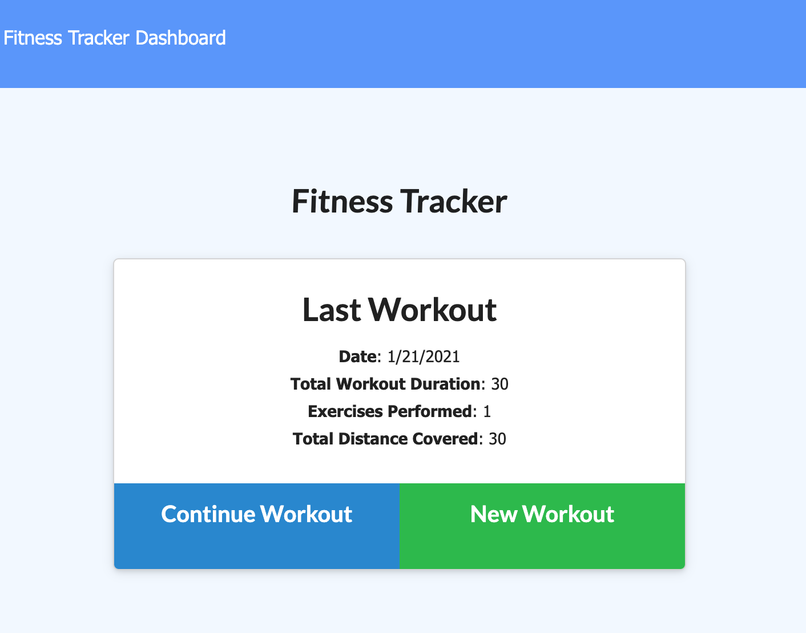
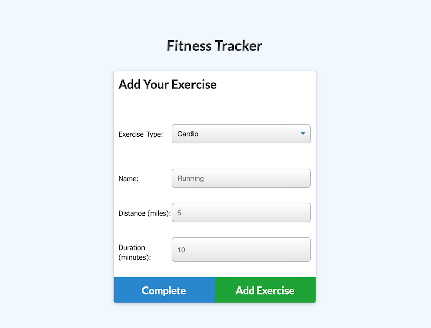
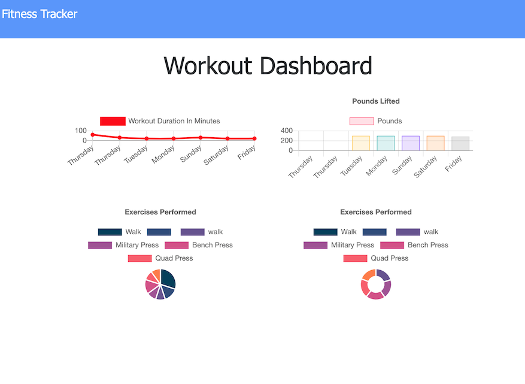

# Fitness.Tracker

[](https://opensource.org/licenses/MIT)
      
     
## Description

Application that tracks daily workouts using MongoDB, Mongoose and Express.

## Table of Contents
 
* [Installation](#installation)
* [Usage](#usage)
* [Credits](#credits)
* [License](#license)
 
## Installation
```
ttps://tranquil-temple-97104.herokuapp.com/ 
``` 

## Usage
ttps://tranquil-temple-97104.herokuapp.com/  

#### Homepage 
 

#### Enter new workout: 
   

#### See all workouts for the last 7 days:
 

## License
This project is covered under the MIT License.
 


## Tests
```
npm test
``` 

## Questions
- [Email](lee.amber.alex@gmail.com)
- [Github Page](https://github.com/lee-amber-alex)
 
